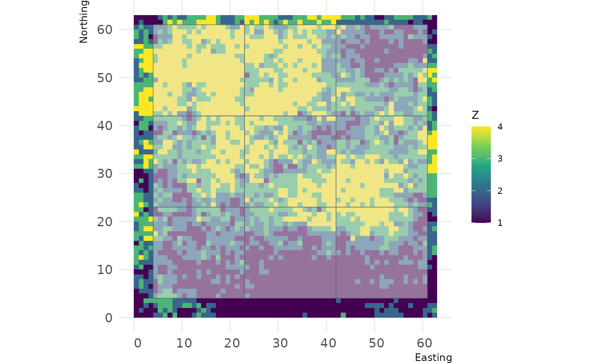
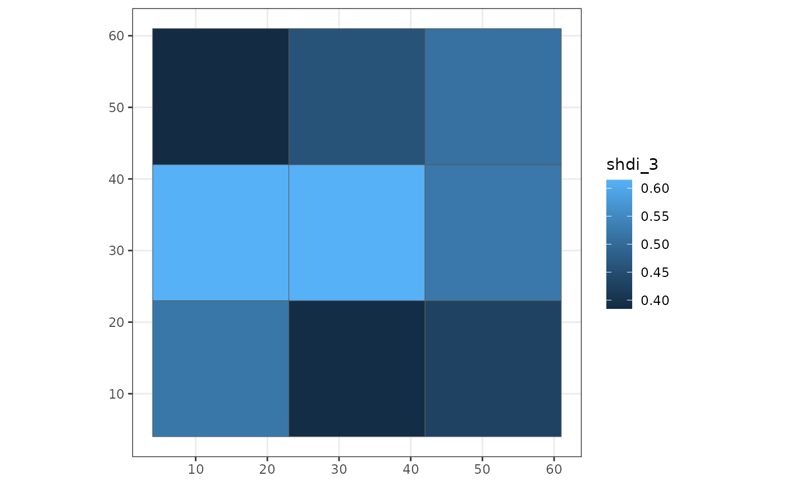
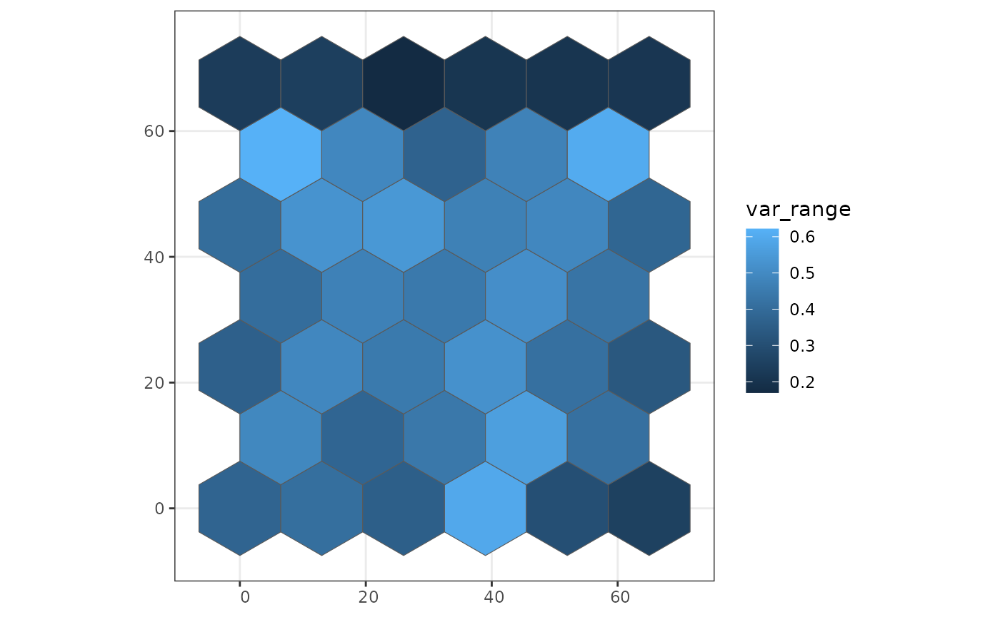
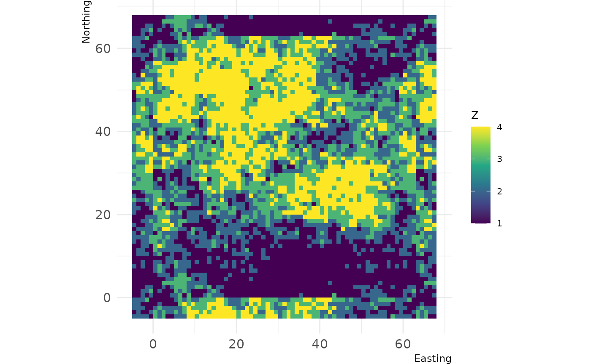

# Using Grainchanger

## Package overview

The primary functions of the `grainchanger` package are those which
facilitate moving-window (`winmove_agg`) and direct (`nomove_agg`) data
aggregation. These functions aggregate fine-grain data (`fine_dat`) to a
coarse-grain (`coarse_dat`) using a function specified by the user
(`agg_fun`). The moving-window method takes in an additional function
(`win_fun`) which smooths the fine-grain data prior to aggregation.

The moving-window smoothing function is also available in the package
(`winmove`), as well as several built-in functions, and an additional
utility function for use with simulated landscapes (`create_torus`).

The `winmove` function acts as a convenient wrapper to
[`raster::focalWeight`](https://rdrr.io/pkg/raster/man/focalWeight.html)
and
[`raster::focal`](https://rspatial.github.io/terra/reference/focal.html)
which takes advantage of optimised functions built into the
`grainchanger` package.

## Data aggregation & `sf`

The functions in `grainchanger` have been written to be compatible with
the [`sf`](https://r-spatial.github.io/sf/) package. The online textbook
[Geocomputation with R](https://geocompr.robinlovelace.net/) provides an
introduction to spatial data analysis with the `sf` package.

### Moving-window data aggregation

In this example, we show how to create a coarse grain grid over the
fine-grain data using `st_make_grid` from the `sf` package. We then
aggregate the package data `cat_ls` to this grid using moving-window
data aggregation and plot using `ggplot2`.

``` r
library(grainchanger)
library(sf)
library(ggplot2)

coarse_dat <- cat_ls %>% 
  # get the bounding box
  st_bbox() %>% 
  # turn into an sfc object
  st_as_sfc() %>% 
  # negative buffer 
  st_buffer(-4) %>% 
  # make a square grid
  st_make_grid(cellsize = 19) %>% 
  # turn into sf object
  st_sf()

# we can plot this grid on top of the fine data
landscapetools::show_landscape(cat_ls) + 
  geom_sf(data = coarse_dat, alpha = 0.5)
```



``` r


coarse_dat$shdi_3 <- winmove_agg(coarse_dat = coarse_dat, 
                                 fine_dat = cat_ls,
                                 d = 3,
                                 type = "rectangle", 
                                 win_fun = shdi, 
                                 agg_fun = mean,
                                 is_grid = FALSE,
                                 lc_class = 1:4)

ggplot(coarse_dat, aes(fill = shdi_3)) + 
  geom_sf() + 
  theme_bw()
```



Note that when creating the grid, we made it 4 units smaller (the size
of the moving window) than the fine-resolution data. The reason for this
is that we avoid edge effects created when the moving window goes beyond
the extent of the data. A warning is thrown if `fine_dat` is the same
size as (or smaller than) `coarse_dat`. The below is an example of this,
using `g_sf` from the package.

``` r
g_sf$shei_4 <- winmove_agg(coarse_dat = g_sf, 
                                 fine_dat = cat_ls,
                                 d = 4,
                                 type = "rectangle", 
                                 win_fun = shei, 
                                 agg_fun = mean,
                                 is_grid = FALSE,
                                 lc_class = 1:4)
#> Warning: Moving window extends beyond extent of `fine_dat`
#> You will get edge effects for the following cells of `coarse_dat`:
#> 1,2,3,4,5,6,7,8,9
```

### Direct data aggregation

In this example we show how to read in a shapefile as an `sf` object,
apply direct data aggregation, and plot using `ggplot2`. `cont_ls` is a
fine-resolution RasterLayer provided with the package.

``` r
library(sf)
library(ggplot2)

# coarse_dat <- st_read("your_file.shp")
coarse_dat <- st_read(system.file("shape/poly_sf.shp", package="grainchanger"))
#> Reading layer `poly_sf' from data source 
#>   `/github/home/R/x86_64-pc-linux-gnu-library/4.5/grainchanger/shape/poly_sf.shp' 
#>   using driver `ESRI Shapefile'
#> Simple feature collection with 39 features and 1 field
#> Geometry type: POLYGON
#> Dimension:     XY
#> Bounding box:  xmin: -6.5 ymin: -7.505553 xmax: 71.5 ymax: 75.05553
#> CRS:           NA

coarse_dat$var_range <- nomove_agg(coarse_dat = coarse_dat,
                                   fine_dat = cont_ls,
                                   agg_fun = var_range,
                                   is_grid = FALSE)

ggplot(coarse_dat, aes(fill = var_range)) + 
  geom_sf() + 
  theme_bw()
```



## Functions

There are a number of inbuilt functions in the grainchanger package,
with their usage outlined below. While it is possible to use
user-defined functions within both `winmove_agg` and `nomove_agg`, we
welcome suggestions for additional functions. Please [add as an
issue](https://github.com/ropensci/grainchanger/issues) - doing it this
way means we can maximise the speed of the function.

| Function.Name | Description | Additional.arguments |
|:---|:---|:---|
| prop | Calculate the proportion of a given class | lc_class (numeric) |
| shdi | Calculate the Shannon diversity | lc_class (numeric) |
| shei | Calculate the Shannon evenness | lc_class (numeric) |
| range | Calculate the range of values |  |

## Additional utilities

### Create torus

The `create_torus` function takes as input a square or rectangular
landscape and pads it by a specified radius, creating the effect of a
torus. We developed this function in order to avoid edge effects when
testing methods on simulated landscapes (such as those from
[NLMR](https://ropensci.github.io/NLMR/)).

``` r
torus <- create_torus(cat_ls, 5)

landscapetools::show_landscape(torus)
```



### Running aggregation in parallel

The `winmove_agg` and `nomove_agg` functions have been designed to work
with the [`future`](https://github.com/HenrikBengtsson/future) package.
This means that with just one additional line of code, the functions can
be run in parallel while taking advantage of the resources available to
the user.

    library(future)
    plan(multisession)

See the [`future`](https://github.com/HenrikBengtsson/future)
documentation for more information.
