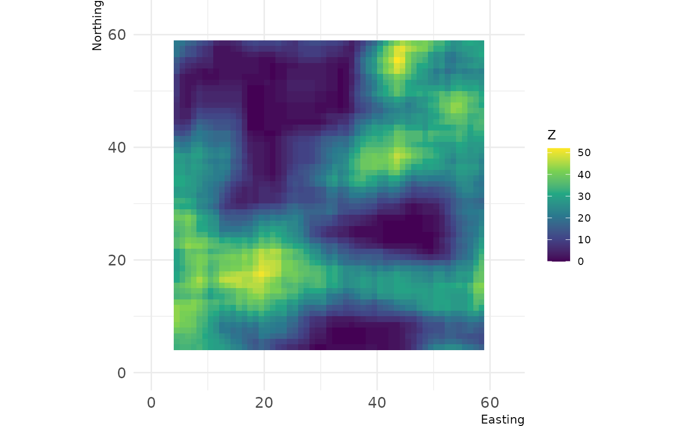
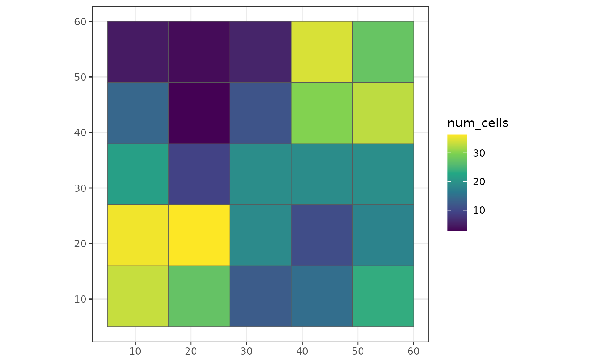
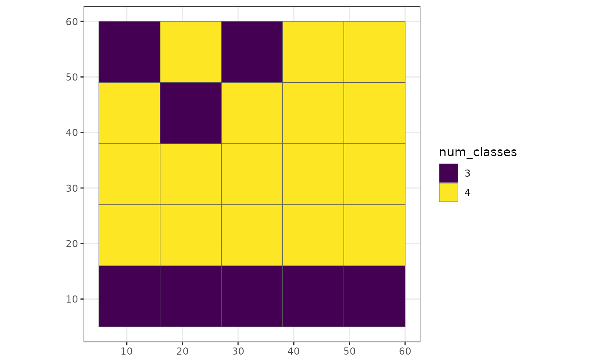
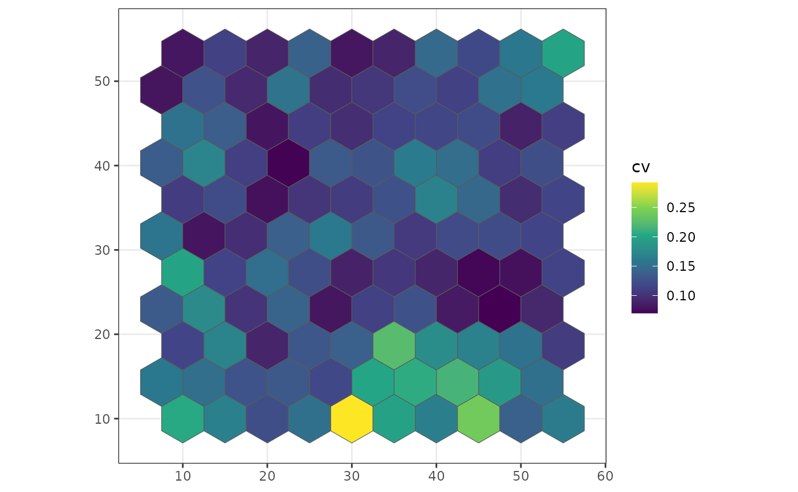

# User-defined functions

Within the `winmove`, `winmove_agg` and `nomove_agg` functions, it is
possible to use user-defined functions for both `win_fun` and `agg_fun`
arguments.

> **WARNING** User-defined functions can be slower within the
> `grainchanger` functions because they have not been optimised. This is
> likely to be of particular issue with large datasets.

## User-defined `win_fun` example

Any user-defined `win_fun` should follow the rules of the `fun` argument
in
[`raster::focal`](https://rspatial.github.io/terra/reference/focal.html):

> The function fun should take multiple numbers, and return a single
> number. For example mean, modal, min or max. It should also accept a
> na.rm argument (or ignore it, e.g. as one of the ‘dots’ arguments. For
> example, length will fail, but function(x, …){na.omit(length(x))}
> works.

In this example, we define a function which counts the number of cells
of a given class within a moving window.

``` r
library(grainchanger)
library(landscapetools)
#> Warning: package 'landscapetools' was built under R version 4.5.3

num_cells <- function(x, lc_class, ...) {
  return(sum(x == lc_class))
}
d <- winmove(cat_ls, 4, "rectangle", num_cells, lc_class = 2)
show_landscape(d) 
```



This can also be used within `winmove_agg`

``` r
library(ggplot2)
g_sf$num_cells <- winmove_agg(g_sf, cat_ls, 4, "rectangle", num_cells, lc_class = 2)
#> Warning: aggregation assumes all cells are rectangular
#> • set `is_grid = FALSE` if coarse_dat is not a grid
#> Warning: Moving window extends beyond extent of `fine_dat`
#> You will get edge effects for the following cells of `coarse_dat`:
#> 1,2,3,4,5,6,7,8,9

ggplot(g_sf, aes(fill = num_cells)) + 
  scale_fill_viridis_c() + 
  geom_sf() + 
  theme_bw()
```



## User-defined `agg_fun`

In this example, we define a function which calculates the number of
land cover classes within each coarse grain cell.

``` r
num_classes <- function(x, ...) {
  length(unique(x))
}

g_sf$num_classes <- nomove_agg(g_sf, cat_ls, num_classes)
#> aggregation assumes all cells are rectangular
#> • set `is_grid = FALSE` if coarse_dat is not a grid

ggplot(g_sf, aes(fill = as.factor(num_classes))) +
  scale_fill_viridis_d("num_classes") + 
  geom_sf() + 
  theme_bw()
```



We can also define functions which work on continuous landscapes. For
example, below we calculate the coefficient of variation for each coarse
cell.

``` r
cv <- function(x) {
  sd(x) / mean(x)
}

poly_sf$cv <- nomove_agg(poly_sf, cont_ls, cv)
#> aggregation assumes all cells are rectangular
#> • set `is_grid = FALSE` if coarse_dat is not a grid

ggplot(poly_sf, aes(fill = cv)) +
  scale_fill_viridis_c() + 
  geom_sf() + 
  theme_bw()
```


